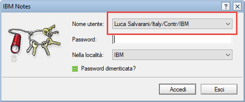
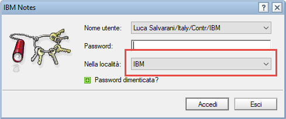

# Notes autoPass
This project aims to provide **password auto-typing** for **IBM Notes** (former Lotus Notes) on **Windows** only

## Introduction
I'm sick of having to open Keepass just to make it autotype my password into Notes login form (*yes... it doesn't allow pasting*).

That's why i created this script that opens Notes and types the password right away :)

## Installation and Usage
1. **Download** the executable [here](https://github.com/LukeSavefrogs/notesAutoPass/releases) and place it in a folder of your choice (_in my case it will be `C:\Users\Luca Salvarani\Desktop\Script\notesOpen.exe`_)

2. Now just **launch** it making sure to specify the password with the **`-p` parameter** (otherwise it will print an error and exit).   
   Example: 
	- In the field "Destination" of a **shorcut** or in a **CLI** applicaion (Command Prompt, PowerShell): 
		```
		"C:\Users\Luca Salvarani\Desktop\Script\notesOpen.exe" -p=your_password
		```
	- Inside **Cygwin**:
		```
		$(cygpath -u "C:\Users\Luca Salvarani\Desktop\Script\notesOpen.exe") -p=your_password
		```
### Pay attention to spaces
If the **password** or any other parameter value contains a <kbd>SPACE</kbd> character, make sure to enclose it first in single quotes, then in double quotes. Example:
```
"C:\Users\Luca Salvarani\Desktop\Script\notesOpen.exe" -p='"your password with spaces"'
```

## Options
<table>
	<thead>
		<tr>
		<th>Parameter</th>
		<th>Type</th>
		<th>Description</th>
		</tr>
	</thead>
	<tbody>
		<tr>
			<td>
				<nobr><code>-p</code></nobr>
				<br>
				<nobr><code>--password</code></nobr>
			</td>
			<td>REQUIRED</td>
			<td>
				Specify password to be sent to the Login form
			</td>
		</tr>
		<tr>
			<td>
				<nobr><code>-d</code></nobr>
				<br>
				<nobr><code>--directory</code></nobr>
			</td>
			<td>OPTIONAL</td>
			<td>
				If you proceeded to a custom installation, you may have installed Notes in a custom path. 
				<br><br>
				This parameter lets you define the directory where is located the <code>notes.exe</code> executable file (<i>default is <code>C:\Program Files (x86)\IBM\Notes\notes.exe</code></i>)
				<br><br>
				To specify a path containing a space character enclose it first in single quotes, then in double quotes, like this: <code>-d='"C:\My Custom Path\IBM\Notes\"'</code>
			</td>
		</tr>
		<tr>
			<td>
				<nobr><code>-u</code></nobr>
				<br>
				<nobr><code>--username</code></nobr>
			</td>
			<td>OPTIONAL</td>
			<td>
				<span>
					Changes the Username by selecting one in the dropdown. 
					<br>
					<br>
					<strong>NOTE</strong>: You MUST provide <strong>exactly</strong> the same value you would pick from the dropdown (in the example below: <code>Luca Salvarani/Italy/Contr/IBM</code>)
				</span>
				<br><br>
				  
			</td>
		</tr>
		<tr>
			<td>
				<nobr><code>-l</code></nobr>
				<br>
				<nobr><code>--location</code></nobr>
			</td>
			<td>OPTIONAL</td>
			<td>
				<span>
					Changes the desired Location by selecting one in the dropdown.
					<br>
					<br>
					<strong>NOTE</strong>: You MUST provide <strong>exactly</strong> the same value you would pick from the dropdown (in the example below: <code>IBM</code>)
				</span>
				<br><br>
				
			</td>
		</tr>
		<tr>
			<td>
				<nobr><code>-w</code></nobr>
				<br>
				<nobr><code>--wait-input</code></nobr>
			</td>
			<td>OPTIONAL</td>
			<td>
				Don't click on the login button after entering the password, but wait for user to click on it manually (it won't prevent the Username or Location to be changed, if present)
			</td>
		</tr>
		<tr>
			<td>
				<nobr><code>-t</code></nobr>
				<br>
				<nobr><code>--timeout</code></nobr>
			</td>
			<td>OPTIONAL</td>
			<td>
				Useful when changing the password. Simply autotypes the provided password into the focused element after the provided timeout in ms, so make sure to click <strong>into</strong> the input field before the timeout expires
			</td>
		</tr>
		<tr>
			<td>
				<nobr><code>-x</code></nobr>
				<br>
				<nobr><code>--debug</code></nobr>
			</td>
			<td>OPTIONAL</td>
			<td>
				Enables the Debug Mode. Shows a MsgBox with data useful for debugging
			</td>
		</tr>
		<tr>
			<td>
				<nobr><code>-h</code></nobr>
				<br>
				<nobr><code>--help</code></nobr>
			</td>
			<td>OPTIONAL</td>
			<td>
				Prints a small help on the available parameters
			</td>
		</tr>
	</tbody>
</table>
